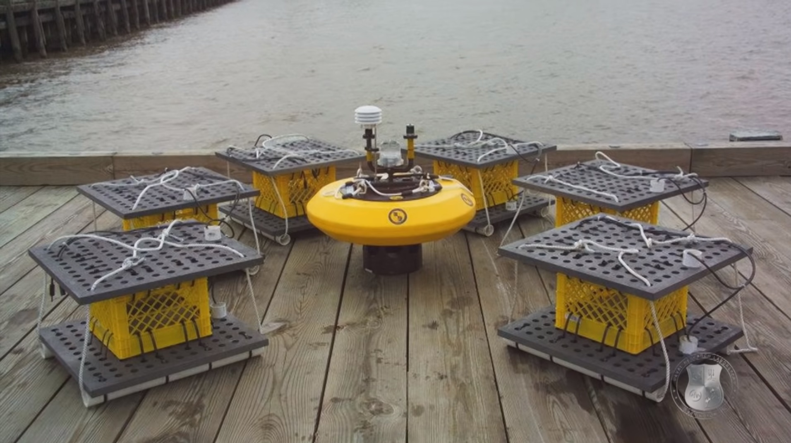

**Senior Scientist for Biosurveillance** serves as the technical expert in the fields of broad-spectrum pathogen identification, bioinformatics, and biosensor deployment.
 
**Senior Scientist for Biosensors and Biomaterials** conducts research and development using biotechnological approaches for solving problems of the Navy, Department of Defense, and the Nation at large.
 
**Laboratory for Bio/Nano Science and Technology** focuses on the discovery and development of functional materials using biology as both a resource and a role model. Scientific and technical development includes engineering of molecules at interfaces, characterization of complex molecular and cellular systems, analysis of the interactions of these systems with the environment, and assessment of the potential of these systems to solve military and dual-use problems. There is also a strong emphasis on creating new hybrid biotic-inorganic materials with properties that are unavailable to either alone, focused on developing bio/non hybrid materials with unique optical, plasmonic, catalytic and energy transfer characteristics. Such materials can be harnessed for energy harvesting, biosensing and developing new types of sensing modalities. 

**Laboratory for Biomaterials and Systems** explores bio-inspired or bio-derived molecules and how they can be used in developing various state-of-the-art naval or dual-use applications. Basic research efforts include investigations on the fundamental design principles that provide stable antibodies in nature, systems biology approaches to understanding marine microbial consortia, control of molecular mesoscale structures through bio/molecular engineering, applications of natural or hybride biological molecules for signal amplification and detection, and computational modeling of biological system dynamics to integrate and predict the functionality of biological systems.
 
**Laboratory for Molecular Interfacial Interfaces** studies a wide range of Science and Technology (S&T) topics comprising the fundamental processes involved in self-assembled systems on surfaces. Fundamental research areas for the Laboratory include exploration of the structures/function relations of surface bound molecules, molecular self-assembled structures, microbial biofilms, and energetic materials. Emphasis on applications spans sensor development, energy harvesting, biofouling inhibition, catalysis, smart coatings, and bio-mimetic propulsion systems. The focus is on the development of advanced materials by tailoring the properties via the nature of the self-assembled architectures of biomolecules.
