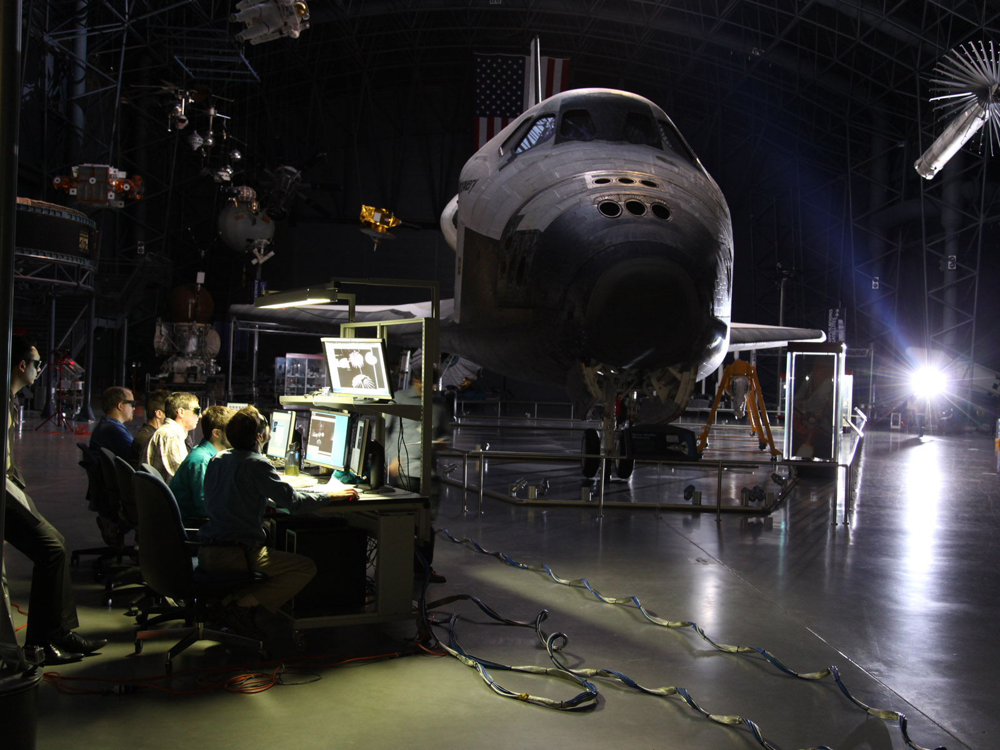

The Attitude Control Section develops attitude determination and control system’s concepts to support spacecraft mission requirements, precision pointing payloads, and verifies designs through analysis, computer simulation, and testing. Personnel have expertise in attitude determination techniques, stabilization, spacecraft and robotic dynamic systems, control actuators, sensors, and inertial components. This section maintains the precision pointing test bed and the space robotics laboratory, specifically the proximity operations test bed.