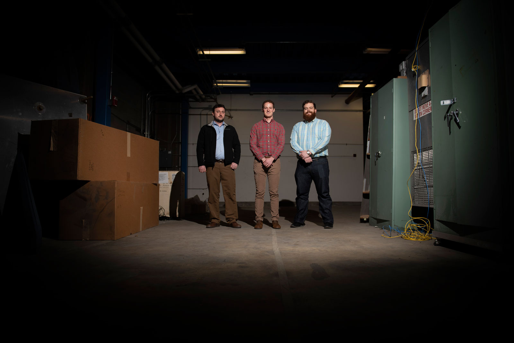

The Design and Verification Branch is responsible for the research, development and verification of mechanical systems for spacecraft and near space systems. The branch mission includes integrated conceptual design trade studies, engineering research, design and analysis, test planning, execution and correlation, prototype and experimental hardware development, and management and operation of the test facilities to verify flight performance.