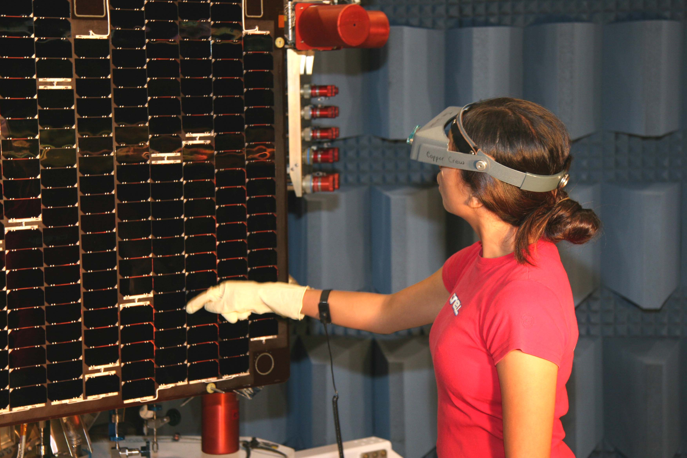

The Digital Flight Systems (DFS) Section develops space qualified digital electronics for use in satellite computing, processing, and storage applications.  DFS incorporates systems engineering principals to develop integrated command and data handling subsystems, to include flight processors and Field Programmable Gate Arrays (FPGAs).  Comprehensive applications of this logic involve aspects of spacecraft control, command uplink, telemetry downlink, high-speed data transfer, on board data storage, image collection, data processing, and telemetry collection and conversion. DFS is involved in parts stress de-rating, worst case timing analysis, failure modes, and radiation survivability to ensure proper function of the FPGAs and entire electronic package in a space environment. DFS utilizes random vibration, thermal cycling, thermal vacuum and Electromagnetic Interference/Electromagnetic Compatibility (EMI/EMC) testing to ensure environmental compliance of packaged systems.