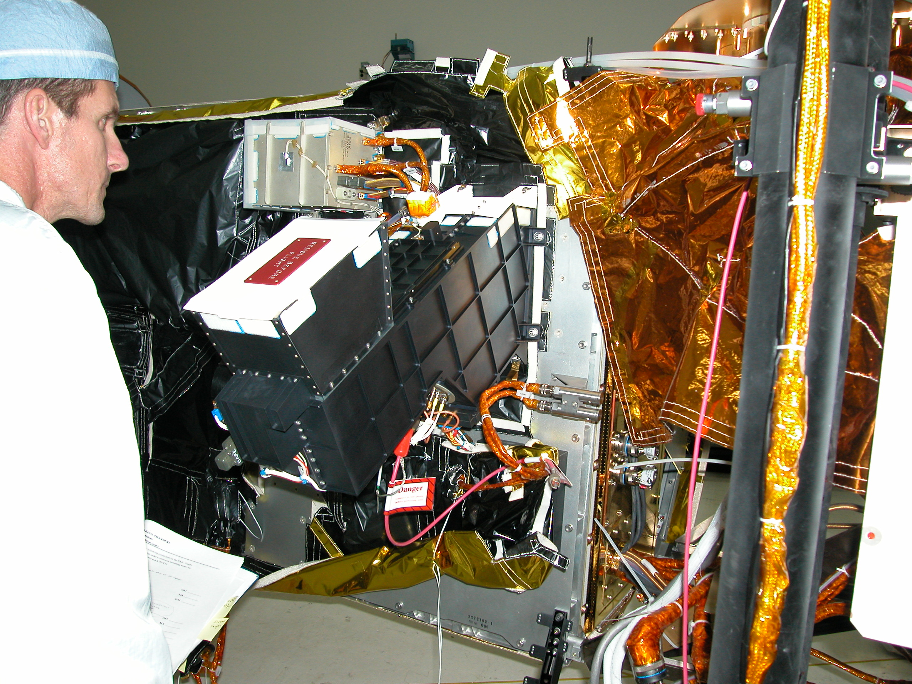

The Electrical Systems Integration Section seeks to field unique and innovative space systems by bringing together the components and subsystems of satellites and space experiments in preparation for launch and operations. This requires the design and development of specialized electronic test equipment to support assembly and test of spaceflight hardware.  Test hardware and software are combined to simulate the interfaces to the spacecraft, and to allow ‘day in the life’ testing to verify operational scenarios.  The section employs various automated tests to ensure proper operations under space and launch conditions, including electrical functional testing, thermal vacuum cycling, vibration and acoustic testing, and electromagnetic and radio frequency testing.