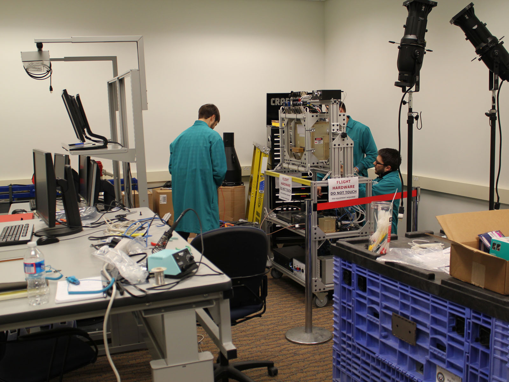

The Embedded Flight Software Section develops software for spacecraft systems from initial concept through on-orbit operations, supporting state-of-the-art advances in spacecraft technologies, operations, and security to satisfy diverse mission requirements. The primary responsibility of Code 8245 is to develop operational flight software for spacecraft command, control, data acquisition and processing. Code 8245 also supports software systems engineering, internal program integration and testing activities, and on-orbit operations. To advance its software development efforts, Code 8245 holds independent program software reviews, writes software systems proposals, and collaborates with external programs.