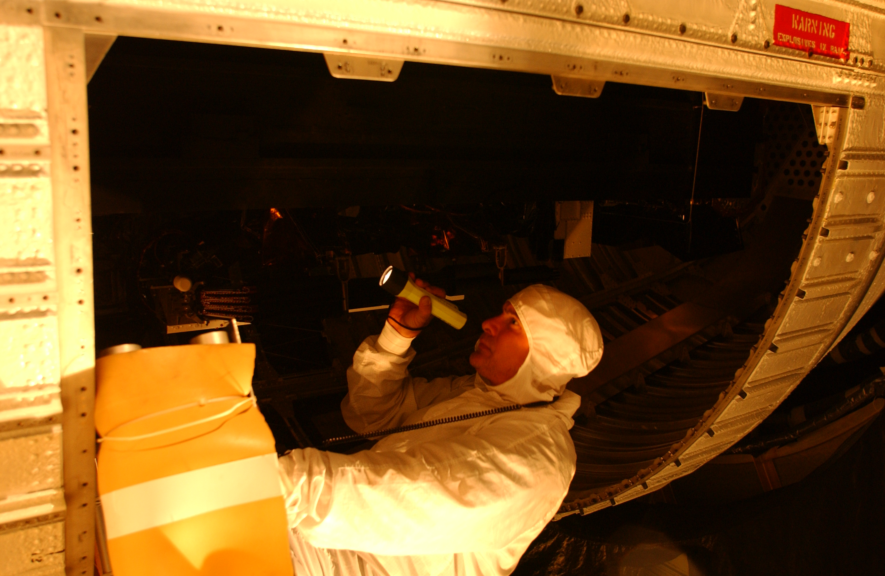

The Mission Development Section performs conceptual development, analysis, and systems engineering evaluations of new spaceflight payloads, spacecraft, and missions. The section assesses new technologies, systems and applications, develops initial budget and schedule estimates, performs feasibility and risk assessments, and establishes program management design structures.