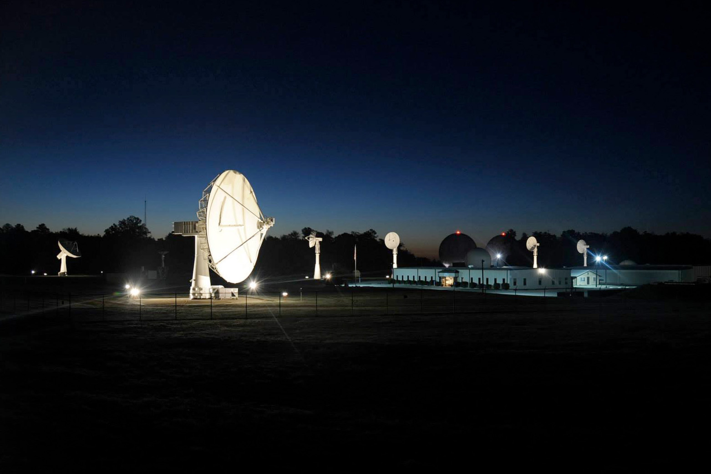

The Mission Operations Branch is focused on secure satellite operations solutions. These solutions include the design, development, and management of satellite mission operations; the command and control of the mission satellites via the Blossom Point Tracking Facility; and the processing of mission data. The branch provides capabilities applicable to all aspects of a satellite mission lifecycle, from the initial concept, through the end of its operational life. Mission Operations provides satellite operation solutions to the Department of Defense and the intelligence community, as well as commercial and civil space organizations. The branch is able to provide flexible and responsive support for any type of spacecraft mission. Ultimately, Mission Operations delivers innovative, resilient, and secure multi-mission satellite operations solutions – including mission design, mission management, and command and control – in response to emerging challenges in the space domain.