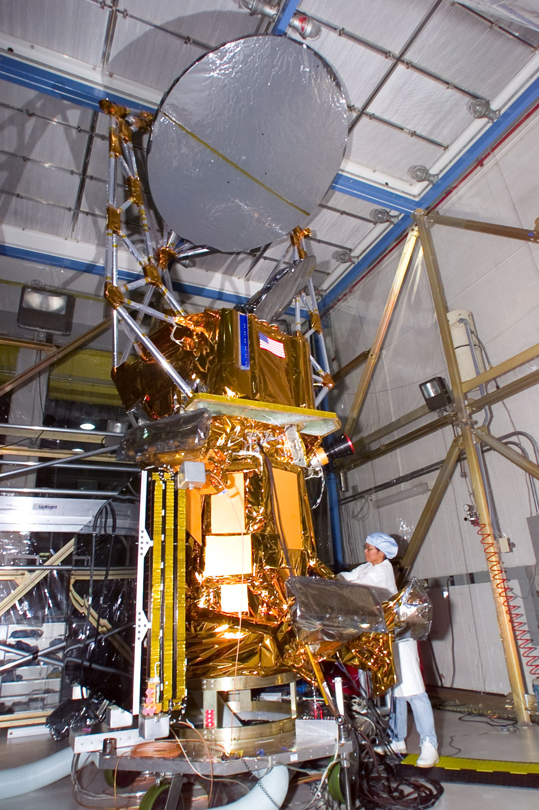

The Mission Planning section determines and solves for the future of autonomous vehicular fleets across multiple domains. Mission Planning performs and applies research in the fields of enterprise software development and operations research to autonomous vehicle mission planning, particularly in the realms of automation and optimization. This section develops and maintains government-owned software mission planning frameworks, such as the Virtual Mission Operations Center® (VMOC®), and applies these frameworks towards specific missions. Mission Planning supports all phases of the mission lifecycle, from design, development, and test through deployment and operations. The purpose of these efforts is to provide the government with capabilities that maximize mission utility, while minimizing development and operational costs.