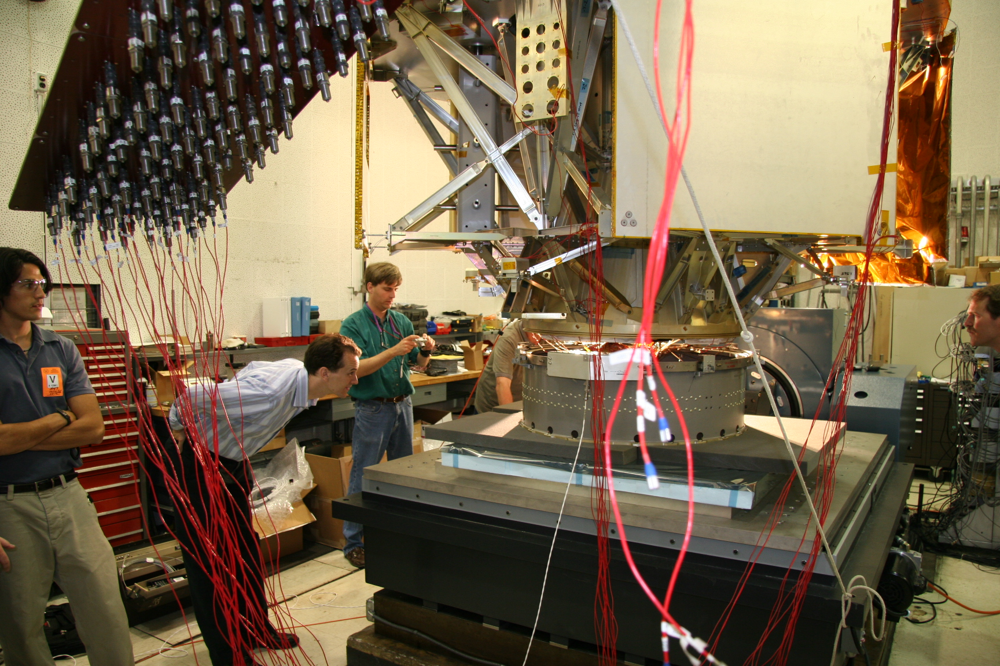

The Power Systems and Instrumentation (PSI) Section leads in the design and development of spacecraft power systems and analog designs used in various spacecraft missions. The section conceptualizes, analyzes, and constructs electrical power system hardware including; solar arrays and batteries, spacecraft power distribution and conversion electronics, payload power distribution and conversion electronics, Multi-type motor control and drive electronics, low noise/high resolution sensor interface electronics, high speed signal transmission electronics, spacecraft and payload system grounding architecture, and power routing. PSI assembles, integrates, tests, and delivers complex power, sensor, and interconnects systems that enable the control, distribution and instrumentation of the spacecraft power, telemetry and command interfaces.