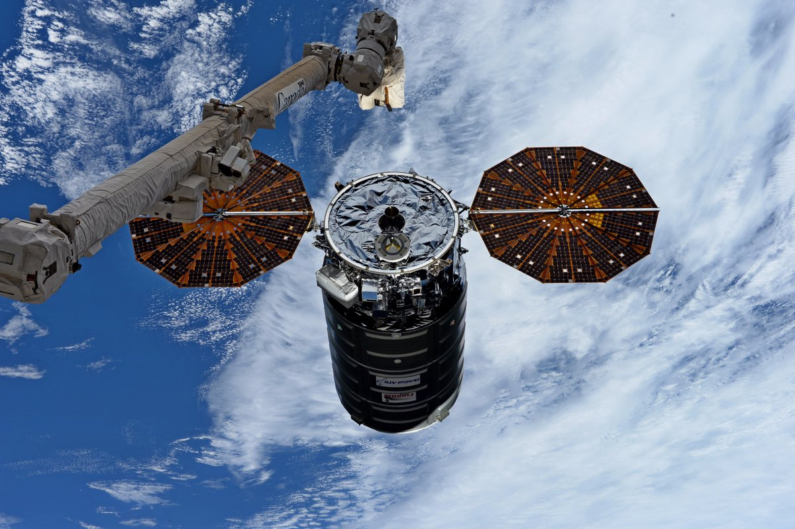

The Radio Frequency (RF) Systems section conceives and develops next generation RF space systems. These systems support a wide range of missions, including communications, microwave radiometers, radar systems, and signal monitoring. The RF section researches advanced and unique antenna systems for space, software defined receivers and transmitters, wideband communications systems, traditional and non-traditional EMI/EMC research and development, and small satellite Type 1 cryptographic solutions for space. The research spans 3 MHz to 250 GHz. The section maintains three state of the art test facilities that include the Antenna Test Lab, which has a 125 foot tapered anechoic chamber, a Near Field scanner capable of making measurements up to 400 GHz, and two state of the art RF Test and Measurement Laboratories.