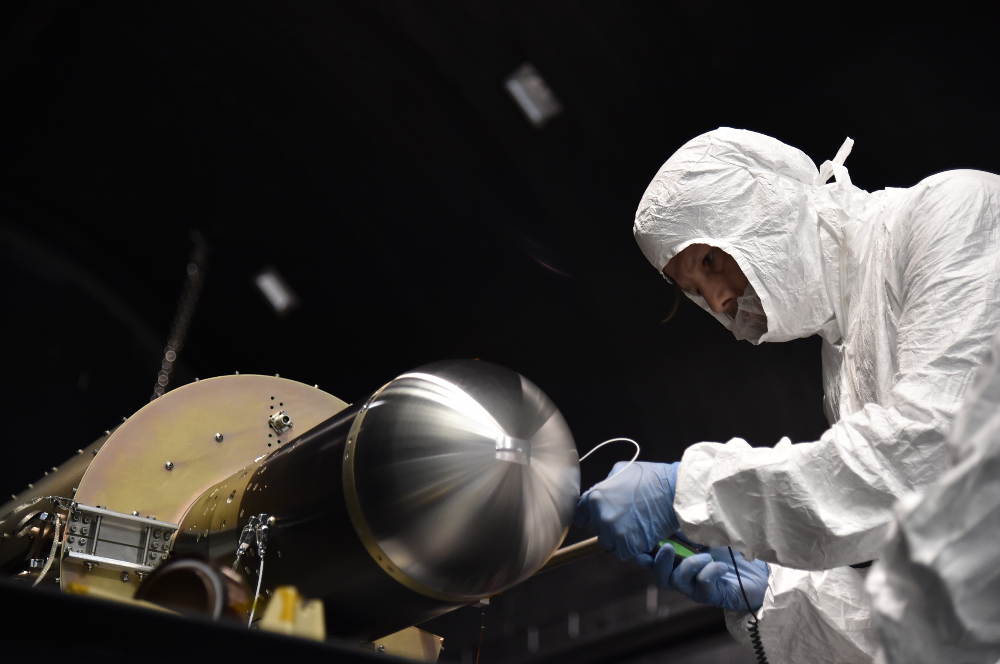

The Structural Engineering Section provides detailed modeling, simulation, and testing of aerospace structural systems. The section supports the full life cycle of system development, to include loads and modal requirements, derivation of aerospace system environments, detailed modeling of system dynamics and load distribution, calculation of structural margins, development of component and system testing procedures, and design and execution of modal loads, and vibration testing in collaboration with the Systems Test Section. Additionally, the section conducts applied research in advanced structural systems to include multifunction structures for novel system application.