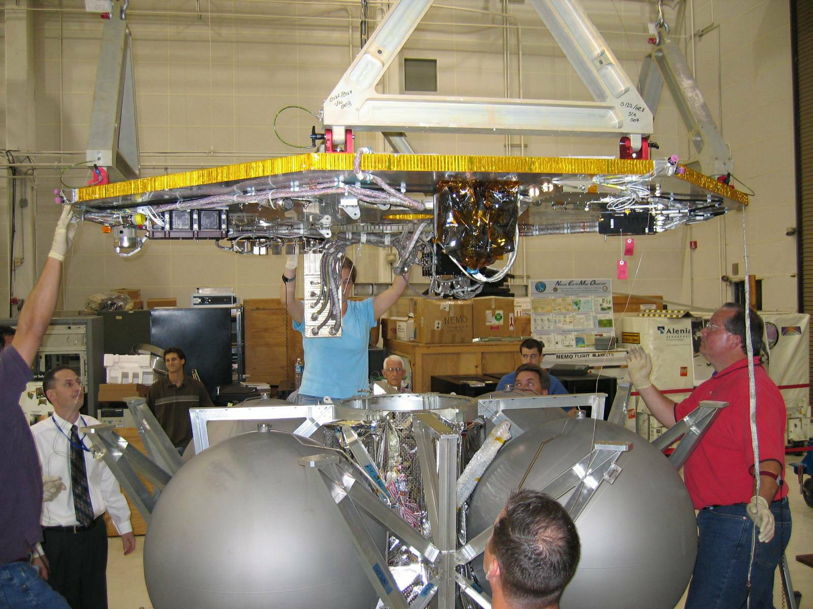

The assembly and test facility provides a central location for all auxiliary machinery and equipment used to support spacecraft, subsystem, and component environmental testing and assembly. The facility consists of a comprehensive laboratory complex housing a high bay (40 ft. high ceiling) assembly area, a secure assembly area (SCIF), support facilities, storage area, lifting equipment, fabrication machinery, and ground transportation equipment. This facility houses mechanical aerospace ground equipment, electrical aerospace ground equipment, propulsion test facilities, and an anechoic chamber.

The Assembly area serves as the fabrication and assembly area for spacecraft and other flight hardware. This area is used for three major assembly types: structural assembly, wire harness assembly, and EAGE checkout and debug. The assembly area contains several lifting cranes to maneuver heavy loads. The secure assembly area, a secure payload area contains a high bah. All test areas are isolated by large access doors to control environment and minimize contamination. The EAGE is assembled, tested, and debugged in the assembly and test facility. The EAGE unit is a total spacecraft electrical system tester tailored for a specific spacecraft, but usable with other spacecraft.
