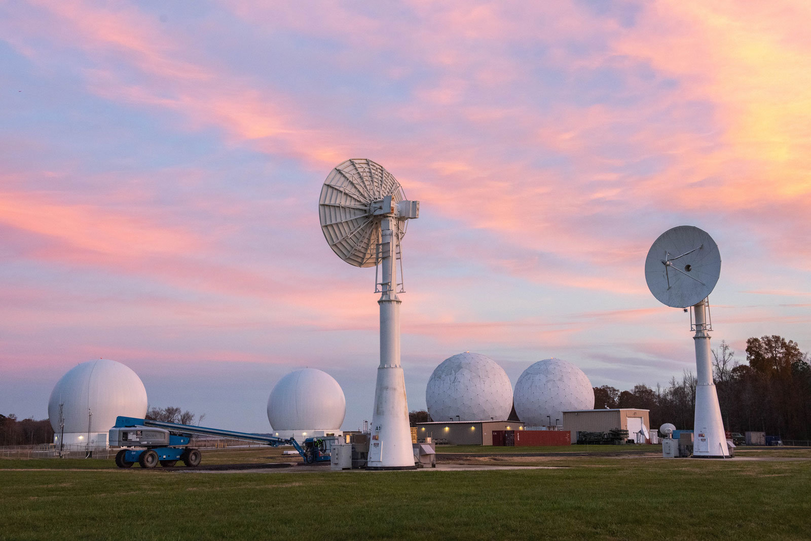

The Blossom Point Satellite Tracking and Command Station (BP) provides simultaneous tracking and data acquisition, health and status monitoring, and command and control for NRL and Navy satellites. The site participates in the development of space systems, both satellite and ground elements, to support Navy mission requirements.

BP is located in Maryland in southern Charles County. The facility is contained on 41 acres located within the U.S. Army Research Laboratory’s property bordering Nanjemoy Creek and the Potomac River. This location provides horizon to horizon look angles and an interference free, low noise environment. To prevent interference with the sensitive satellite antenna radio receivers, the BP Station is protected by a 2000 ft. radius buffer zone. 

The numerous site antennas receive data from and transmit commands to satellites. The station is in continuous operation 24 hours a day, 7 days a week, and supports 27 spacecraft.