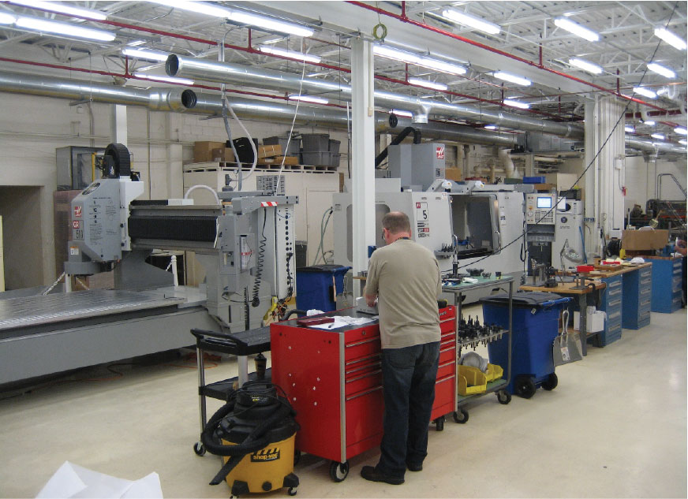

The Machine Shop supports the assembly and integration activities of the Spacecraft Engineering Division with three and five axis CNC machines, a plunge EDM, manual lathes, milling machines, drill presses, shears, and other shop equipment. In addition the machine shop utilizes and advanced CMM with touch and scanning probes, laser scanning, and cision sensor capabilities.