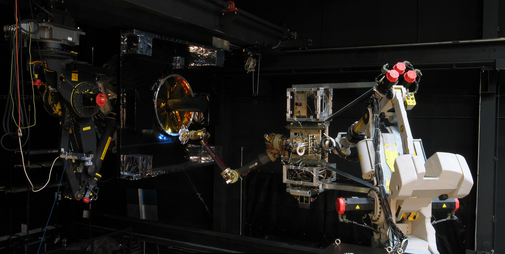

The NRL Space Robotics Laboratory is a world-class facility where the space environment can be simulated so that robotic satellite servicing techniques can be researched, developed, tested, and validated. It supports testing of full-scale hardware-in-the-loop rendezvous, docking, and servicing to include robotic arms, tools to support a variety of servicing missions, control schemes, relative navigation sensors, lights, and cameras, all of which must work as a system to service orbiting client satellites in the harsh environment of space. It consists of two major environmental simulators: the Proximity Operations Testbed (POT), a dual 6 Degree-Of-Freedom relative motion simulator capable of supporting full–scale robotic servicing hardware and client mockups; and the Robotic Assembly Testbed (RAT), an air bearing table capable of simulating the frictionless environment of space. The RAT can support multiple robotic vehicles operating with multiple workspace objects, including large objects such as trusses or solar panels; it also provides cable gravity offload points, meaning that unlike most air bearing simulator it supports true 3D simulations.