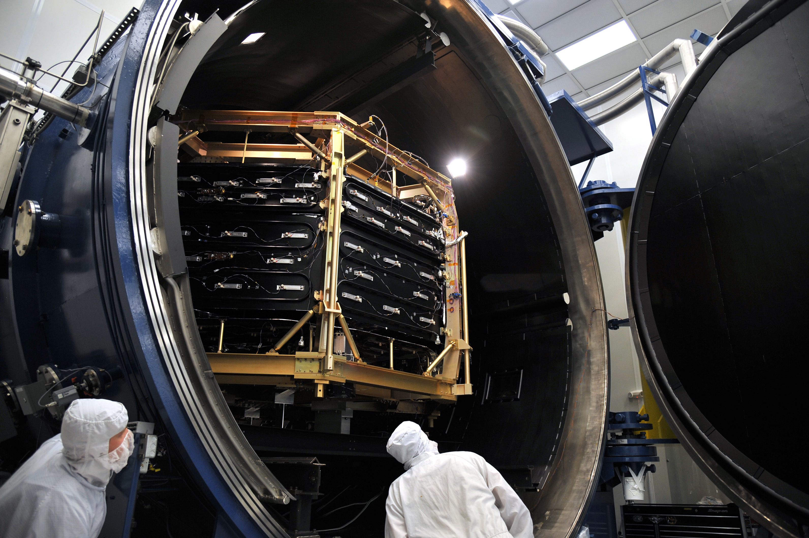

The Thermal High-Vacuum Chamber (TVAC) facilities provide the capability to accurately simulate space environments for space vehicles, experiments, and subsystems, allowing verification of thermal designs and determination of thermal margins and capability.

The TVAC environmental facility consists of three major test chambers, three small test chambers, a machinery room, a network of computers, a 26,000 gallon liquid nitrogen storage facility, and an assortment of handling fixtures and cranes for ground transport of payloads.

All test chambers are equipped with antibackstreaming cold traps and internal thermal shrouds to provide cold and hot thermal environments. The chambers have internal mass spectrometers and quartz crystal micro balances to monitor outgassing. Each chamber is equipped with quartz observation windows, internal video cameras for mechanism observations, low-vacuum convectron gauges, high-vacuum ionization gauges, thermocouple inputs, and computer-controlled electropneumatic-gate valves. All chambers provide hermetically sealed bulkheads for electrical power and radio frequency ingress/egress, as well as power for DC and AC heaters and solar simulation lamps.