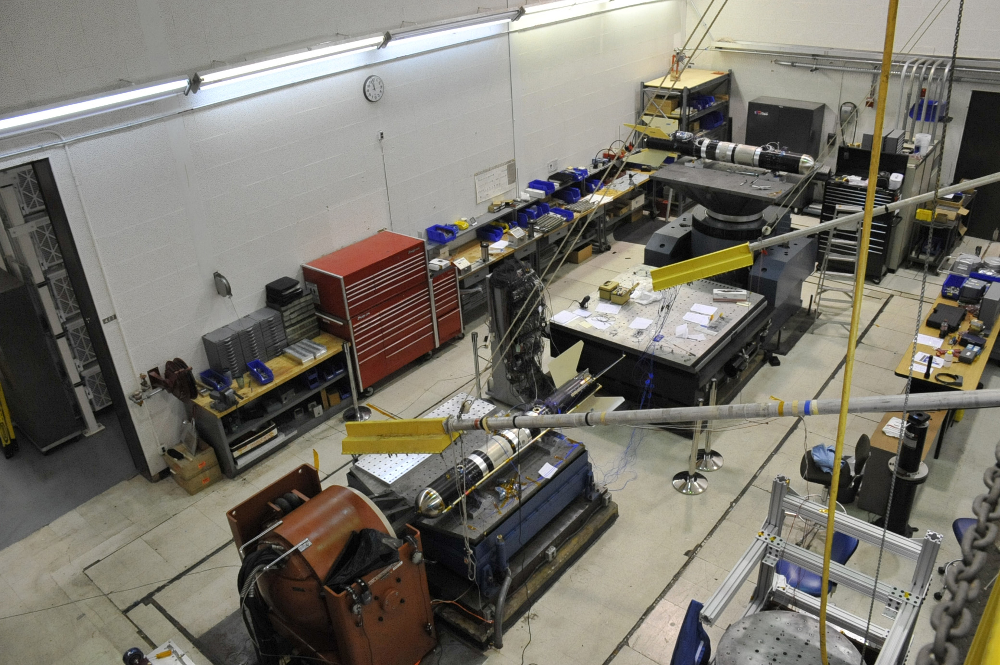

The spacecraft vibration test facility qualifies and accepts spacecraft and spacecraft components by simulating the various loading environments imposed on hardware to demonstrate compliance to design specifications. The facilities electrodynamic shakers can generate quasi-static, vibratory, and shock loads; test-article characteristics can be quantified via sine sweep testing. 

The vibration facility consists of five individual electrodynamic shaker units, three individual power amplifiers and a high-power switching system, a chilled water cooling system, a closed loop controller, a 200-channel data acquisition system, and a variety of support equipment, including fixtures, slip tables, and computer hardware