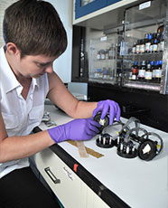
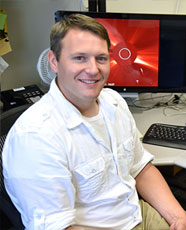
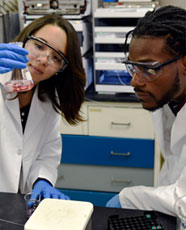

- [Opportunities](/careers/opportunities){class="careers-menu-link"} 
- [Post Docs](/careers/post-doc){class="careers-menu-link"} 
- [Students](/careers/students){class="careers-menu-link"} 
- [Faculty](/careers/faculty){class="careers-menu-link"} 
- [Benefits](/careers/benefits){class="careers-menu-link"} 

NRL conducts cutting-edge research and technology development to make the United States Navy and Marine Corps the most advanced in the world. NRL’s scientists and engineers conduct basic and applied research across a wide spectrum of scientific disciplines for both immediate and long-range national defense needs.

[NRL Careers Brochure](/files/HR_Recruitment_Folder.pdf){class="file-pdf"}

NRL offers its civilian employees a challenging and exciting career in the federal government with flexible work schedules, competitive salaries and world-class research facilities with state-of-the-art equipment. Apply your talents in a creative, hands-on environment, with opportunities for educational and career development. Work with world-renowned scientists and engineers and forge your own path of success **further than you can imagine**. ®