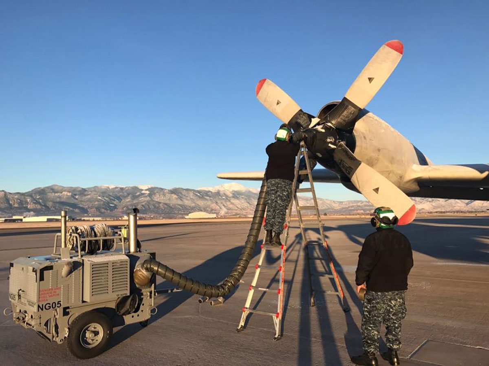
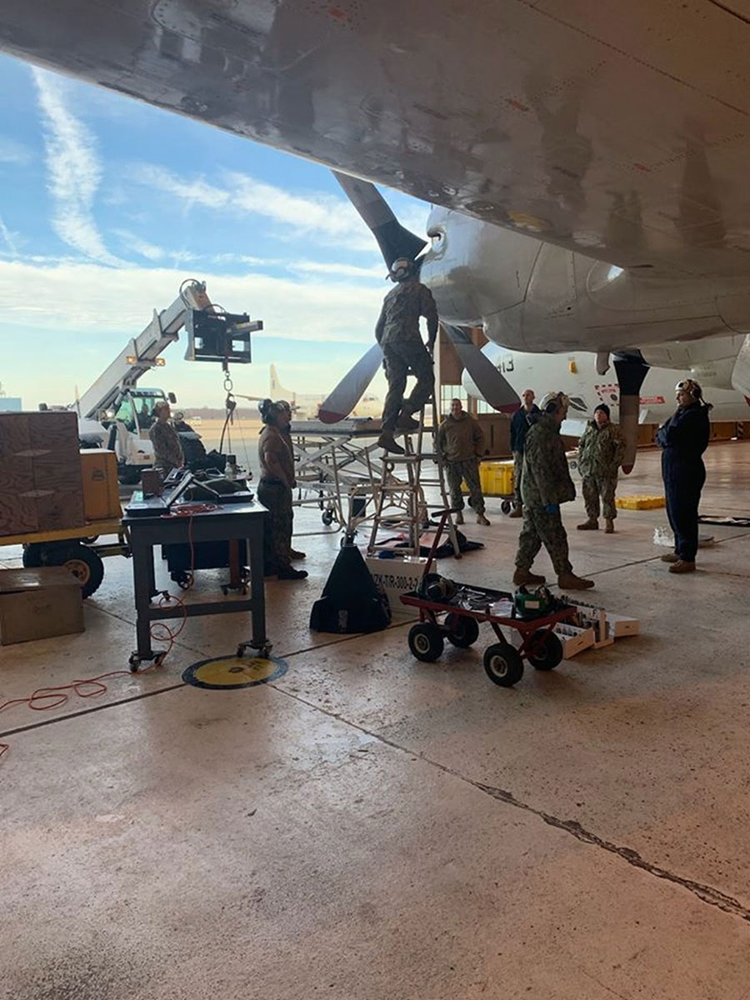

VXS-1 operates as a Service Cost Center within the framework of the Navy Working Capital Fund (NWCF). Accordingly, costs must be recovered via user fees/stabilized billing rate charges to customers.

Customers are charged based on a fixed billing rate per flight hour and for project-specific reimbursable costs. Additionally, to minimize rates charged to customers, and per NWCF financial policies, projects canceled by customers after work has begun will be charged for all direct costs associated with planning, material issues, and associated overhead expenses.

**Scheduling**

Projects (including both airborne projects and installations) shall not be considered "scheduled" until the Military Support Division (Code 1400) has received an Authorization to Charge Research Division Job Order Number form from the customer.

A project can be "penciled in" on the long-range timeline upon receipt of a Flight Service Request form in order to facilitate planning, but the project shall not be moved to the monthly schedules without an Authorization to Charge.

**Notification**

Project managers are advised that the Authorization to Charge Research Division Job Order Number form should be received no later than 90 days before start of installation. If the form is not received and another project with funding requests the aircraft, sponsors shall be notified, and advised that they are being replaced on the schedule.

**Rates**:

**Aircraft Rate**: All customers shall be assessed a weekly fee to 
reserve an aircraft for use during the requested project period:

- $27,000 per week for all NP-3C
- $5,000 per week for all RC-12M
- $5,000 per week for all UV-18A

Note: For any calendar week in which 10 project flight hours 
are executed, this fee is waived.

**Flight Hour Rate**:

NRL customers:
- $12,000 per flight hour on NP-3C
- $1,750 per flight hour on RC-12M
- $1,300 per flight hour on UV-18A

Non-NRL customers:
- $16,000 per flight hour on NP-3C
- $3,000 per flight hour on RC-12M
- $3,000 per flight hour on UV-18A

Note: NRL customers are any NRL/ONR research division or customers directly supporting an NRL/ONR research project. Flight Hour Rates may be superseded by a Memorandum of Agreement signed by the Commanding Officer (Code 1000).

Reimbursable Costs: NRL/VXS-1 customers are charged on a full reimbursable basis for costs related to projects which may include: Aircraft Reporting Custodian (ARC) services, specific military manpower support, unique/specific aircrew training, systems integration, mission planning, flight and maintenance crew travel expenses (e.g., travel, hotel, per diem), landing fees, non military contract fuel (additional fuel costs), and other identified project specific costs. Hourly rates for military manpower are indicated on the following page.

Project Director: (301) 342-3504
