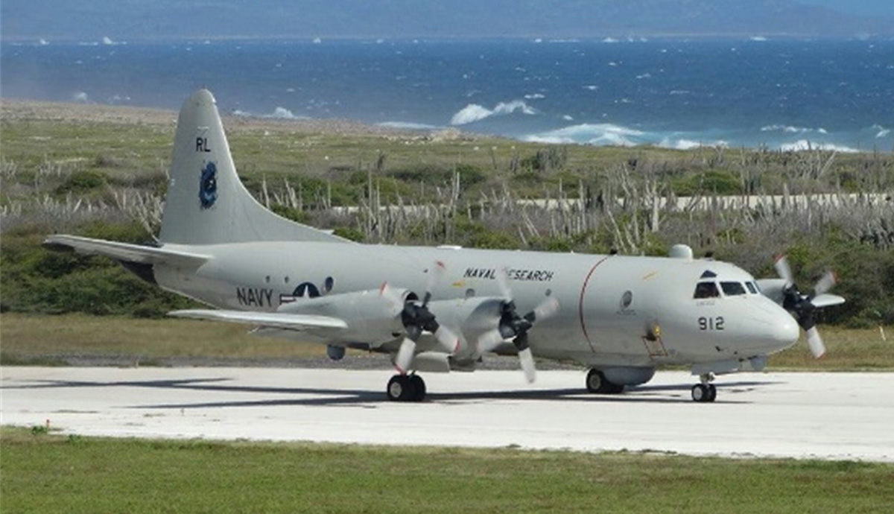
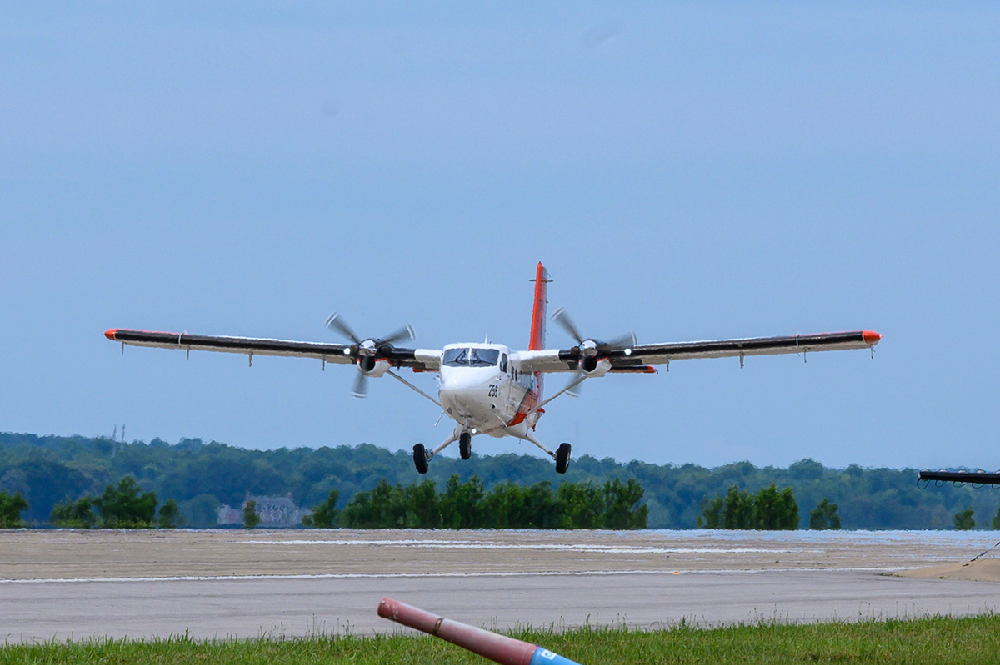
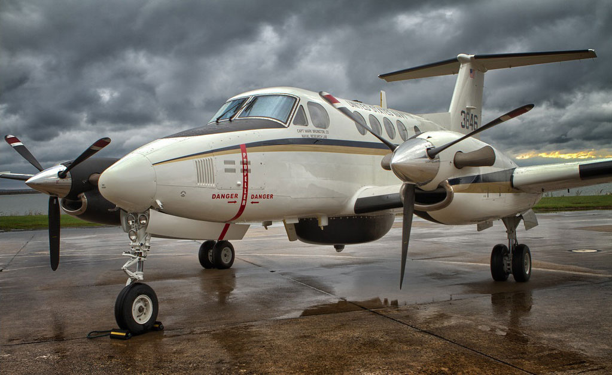
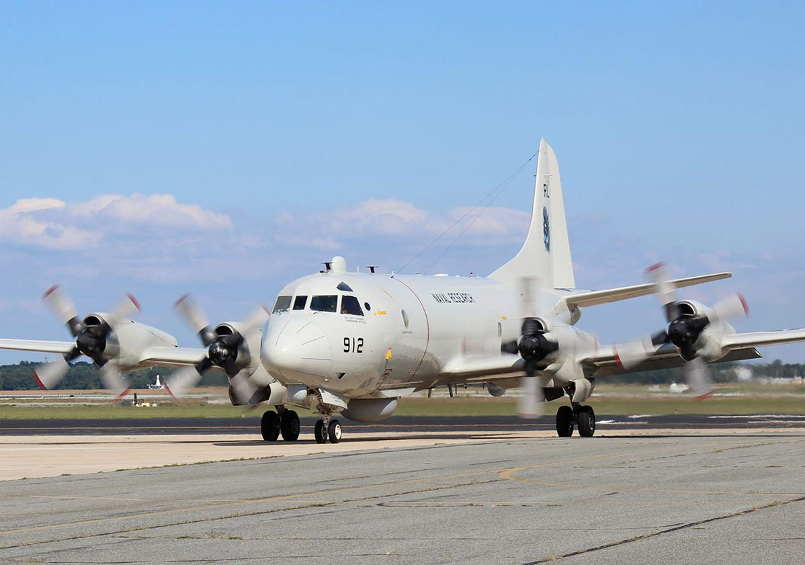

The “Warlocks” of Scientific Development Squadron (VXS) 1, operate and maintain two NP-3C Orion aircraft, an RC-12 Guardrail, a UV-18 Twin Otter, and numerous TigerShark Unmanned Aircraft Systems. 
VXS-1 aircraft operate worldwide on extended detachments and annually log more than 400 flight hours. 
These aircraft are the sole airborne platforms for numerous projects such as bathymetry, electronic countermeasures, gravity mapping, and radar development research. The squadron has a flawless safety record, having amassed more than 77,000 hours of accident-free flying since 1963. 

**Administrative Branch** - Interfaces with the Military Administration/Personnel Branch for the processing/administration of military records, awards, training, travel, and per diem issues for assigned personnel. Additionally the branch is responsible for the promulgation of all VXS-1 policies, instructions, and notices.

**Operations/Projects Branch** - Coordinates the assignment of personnel and aircraft in the accomplishment of research missions. Additionally, the branch interacts with the Operations Branch and project sponsor offices to accomplish scheduling, planning, and execution of projects during execution and out years. The branch is responsible for the generation of the daily flight schedule. Branch personnel ensure completion of flight physicals as well as ground and flight evaluations to maintain professional, medical, and physiological readiness.

**Maintenance Branch** - Responsible for the maintenance, record keeping, reporting, and management of the assigned science and technology (S&T) modified NP-3C aircraft in accordance with applicable specifications and directives. The branch ensures compliance with maintenance, safety, and security procedures as well as adherence to established programs to prevent fuel, hydraulic, and oil contamination and foreign object damage; and to ensure effective corrosion control. The Maintenance Branch maintains liaison with other support branches to ensure aircraft can meet research requirements.

**Safety/NATOPS/Training Branch**  - Ensures compliance with governing safety directives and Navy programs for aviation commands to include aircraft mishap reporting procedures and required proficiency drills. The Branch administers the Naval Air Training and Operating Procedures Standardization (NATOPS) Program for all assigned Code military and flight support aircrew and project specialists to include ground and in-flight evaluations. Branch personnel ensure compliance with all general military training requirements as well as command specified training.

**Configurations Branch** - Coordinates with research project sponsor technical staff, Maintenance Branch and the Operations/Projects Branch to achieve integration of research project equipment onto assigned aircraft. Branch personnel coordinate with customer technical staff to identify specific equipment needs (space, weight, power, etc.). Additionally, branch personnel interact with Naval Air Systems Command (NAVAIR) counterparts to arrange and obtain equipment installation approvals and flight clearances as well as with organic and external service providers to facilitate the installation and/or removal of specialized project equipment and support infrastructure. The branch provides long-range planning capabilities to avoid conflict among future projects and to enable satisfaction of even the most demanding project requirements. The Configurations Branch maintains liaison with other codes to ensure assigned personnel can meet anticipated research requirements.

