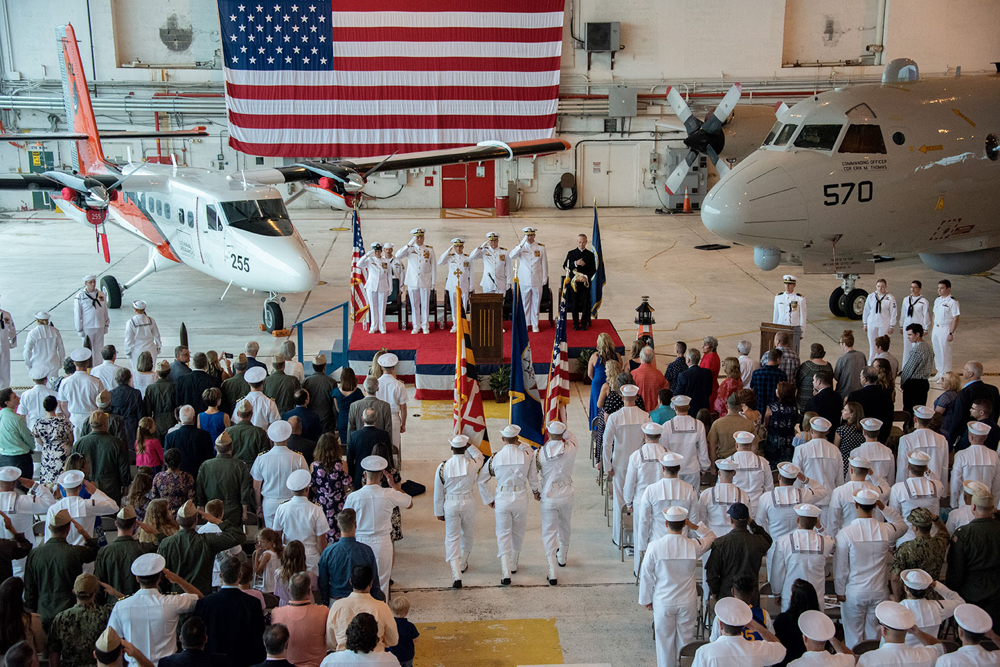

The Military Support Division provides operational and administrative services to NRL.

**Operations Branch** - Assists NRL Research Directorates in the planning and execution of project flight missions, develops deployment schedules and military operational and training objectives, and coordinates the Research Reserve Program within NRL. For coordination of projects and funding please contact (202) 767-2272/7511.

**Military Administration/Personnel Branch** - Responsible for the coordination and efficient functioning of all military administrative operations for NRL, VXS-1, and all NRL detachment sites. These duties specifically include personnel actions, maintenance of personnel records, performance evaluations, awards and training and advising the NRL Commanding Officer and Chief Staff Officer on manpower matters and organization issues. For administrative of sponsor assistance, please contact (202) 767-7627/2103.

**Administrative Office** - Responsible for providing civilian personnel and financial services for the Military Support Division (Code 1400) and Scientific Development Squadron (VXS) 1 (Code 1600). The AO also assists the division head (Code 1400) and VXS-1 commanding officer (Code 1600) in the achievement and maintenance of the effective and economical operation of the division and squadron. Specific functions include preparing and administering the division budgets; reviewing and analyzing the expenditure of division funds to ensure economy in such expenditures; reviewing proposed key division Requirements Documents (RDs) for organizational alignment and making recommendations to the division head; reviewing, analyzing, and modifying as necessary existing division financial processes and procedures; and assisting the division head in planning and providing space, services, and equipment to accommodate division operations, and coordinating these requirements with all appropriate NRL divisions.