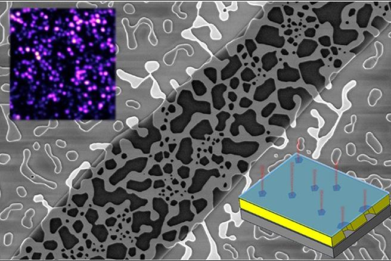

WASHINGTON - Scientists at the U.S. Naval Research Laboratory discovered a new platform for quantum technologies by suspending two-dimensional (2-D) crystals over pores in a slab of gold. This new approach may help develop new materials for secure communication and sensing technologies based on the unique laws of physics at the atomic levels.

“We never expected these atomically thin materials could influence the ordering of all of the atoms in such a relatively large slab of gold,” said Jeremy Robinson, a materials research scientist at NRL. “When heated, the metal reflows to form a porous structure and the gold atoms lock into registry with the atoms in the 2-D layer on top.”

Suspended two-dimensional crystals over pores in a slab of gold (center image) allow NRL scientists to connect quantum light sources (inset images) in a ready-made network (Graphic credit: Jeremy Robinson/U.S. Naval Research Laboratory)

The research team expected to observe dewetting, a process resulting from interaction between surfaces of two solids. Instead of droplets forming on the glass base underneath the gold, heating caused a reorientation of the underlying metal slab. The gold became porous throughout and this physical change led researchers to test for other side effects of the merger.

“We also discovered this combination can create a large number of quantum light sources in a, sort of, ready-made network,” said Andrew Yeats, research physicist at NRL. “The alignment between atomic layers may facilitate energy transfer between the emitters through the gold framework that connects them.”

Researchers verified light emanating from the 2-D semiconductors comes out as single light particles, or photons. These emitters can transfer energy to each other through the gold layer.

“We shine light on one part of the sample and we look at the light coming off at another part,” Robinson said. “This teaches us how energy can be coupled into the gold layer at one point, propagated to a different quantum emitter site far away and re-emitted as light that we could see.”

The ability to remotely control the piping of energy to a single-photon emitter makes this an attractive system for quantum technology.

“As we get better at controlling how the 2-D semiconductor interacts with pores in the metal film, it’s easy to imagine different technologies that could use these properties.” Robinson said. “Sensors are a good first target, which can take advantage of the atomically thin membranes stretched across the porous metal framework.”

While researchers conducted this work using a gold slab underneath the thin semiconductor layer, other metals can respond the same way as the gold. The NRL team continues to investigate how various material combinations and structures can create single photon sources with unique properties, a key component of secure communications.

Learn more information about quantum technology at: [https://www.nature.com/articles/s41467-019-13857-0](https://www.nature.com/articles/s41467-019-13857-0)

### About the U.S. Naval Research Laboratory ###

NRL is a scientific and engineering command dedicated to research that drives innovative advances for the Navy and Marine Corps from the seafloor to space and in the information domain. NRL headquarters is located in Washington, D.C., with major field sites in Stennis Space Center, Mississippi, Key West, Florida, and Monterey, California, and employs approximately 2,500 civilian scientists, engineers and support personnel.