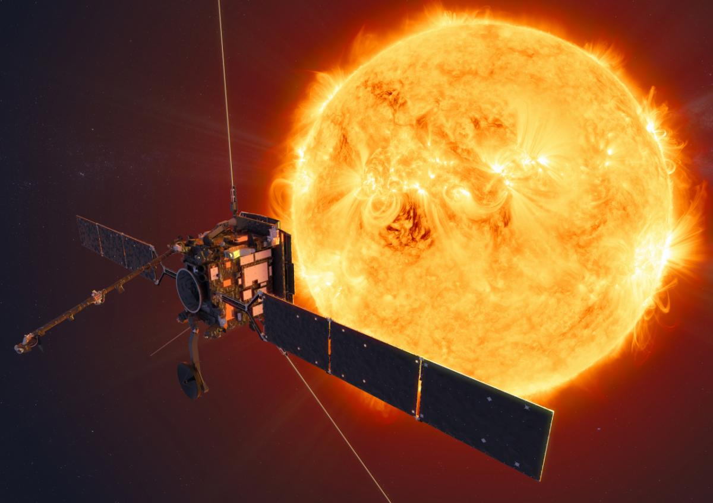

WASHINGTON — The Solar Orbiter mission will use a U.S. Naval Research Laboratory-designed and -built heliospheric camera, known as SoloHI, to provide unique perspectives and unprecedented views of the Sun’s North and South poles. The spacecraft, a NASA and European Space Agency collaboration, launched aboard an Atlas V rocket at Cape Canaveral, Florida, Feb. 9.

Artist's impression of ESA/NASA's Solar Orbiter spacecraft (Image Courtesy of ESA/ATG Medialab)

A number of other solar missions are currently studying the Sun’s impact on Earth. Those spacecraft, however, travel in the same plane Earth orbits the Sun while the Solar Orbiter circles at an angle off this ecliptic plane to provide views of each pole.

“The magnetic field at the Sun’s poles are controlling the overall magnetic structure of the interplanetary magnetic field. We’re just embedded in the Sun’s magnetic field,” said NRL astrophysicist Robin Colaninno. “When solar storms occur, that’s the Earth’s magnetic field interacting with the Sun’s magnetic field. That’s what generates aurora borealis and similar events that have a great deal of effect here on Earth.”

An aurora is a light show caused by collisions between electrically charged particles released from the Sun that enter the Earth's atmosphere and collide with gases such as oxygen and nitrogen. The Northern and Southern Hemispheres light up around the magnetic poles.

Researchers can use SoloHI and the other nine instruments on Solar Orbiter to examine phenomena on the Sun like never before since the spacecraft looks down at the Sun, instead of viewing it from the side.

“We see an event at one point in the solar atmosphere. The question has always been, ‘does that instability occur in isolation or does it impact other regions as well,’” said SoloHI principal investigator Russ Howard. “Now, we will have a view of this whole region. If something goes off in one area, we’ll be able to see it propagating through the atmosphere.”

Solar Orbiter seeks to resolve the physics of the stream of charged particles from the Sun. SoloHI will image the variable solar wind as it leaves the Sun, and as it hits the spacecraft and heads to Earth.

“We know that the interplanetary medium is filled with charged dust, but all the space weather models ignore this dust,” said Howard. “Solar Orbiter is putting the focus back on the processes that are involved in transporting material from the Sun to Earth.”

For the next seven years, scientists will look to Solar Orbiter to supplement results from other missions for a comprehensive look at this huge volume of space. Refined forecasts of solar storms, and other Sun-related disturbances, will improve satellite communications and spacecraft operations in the solar system.

###About the U.S. Naval Research Laboratory###

NRL is a scientific and engineering command dedicated to research that drives innovative advances for the Navy and Marine Corps from the seafloor to space and in the information domain. NRL headquarters is located in Washington, D.C., with major field sites in Stennis Space Center, Mississippi, Key West, Florida, and Monterey, California, and employs approximately 2,500 civilian scientists, engineers and support personnel.