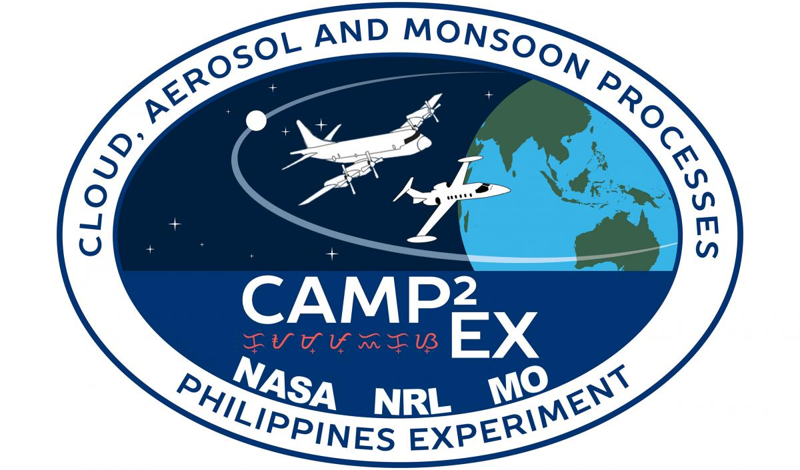
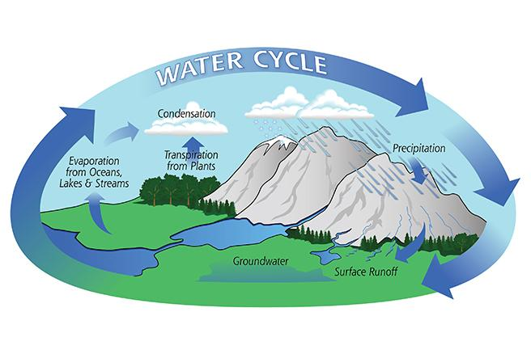

WASHINGTON — U.S. Naval Research Laboratory meteorologist Jeffrey Reid is at the forefront of research studying the role of aerosol particles, and the relationships between the particles with monsoon meteorology, clouds and the sun’s radiation.

Aerosol particles floating through the environment harbor big mysteries to scientists globally. The particles range in size from bundles of molecules (10nm) to a grain of sand, and are capable of surfing through the air for thousands of miles. Small and seemingly insignificant on their own, the particles travel as inanimate swarms, influencing the earth’s weather and climate in ways scientists do not yet fully understand.

Reid served as the mission scientist for the international field campaign, [The Cloud, Aerosol and Monsoon Processes Philippines Experiment (CAMP2Ex)](https://espo.nasa.gov/camp2ex/content/CAMP2Ex), the largest airborne field campaign to date in Maritime Southeast Asia. The NASA-initiated campaign studied tropical weather and aerosols in the South East Asian Region last year from August to October.

As the mission scientist, Reid was responsible for managing the daily operations of the science and flight teams. His efforts ensured the team of more than 150 scientists efficiently and safely collected data despite extreme weather conditions and challenging geophysical features.

CAMP2Ex was a partnership with NASA, NRL, the Manila Observatory, the Philippine Atmospheric, Geophysical and Astronomical Services Administration (PAGASA), and various academic organizations. Researchers on the campaign sought to collect data to answer three key questions:

– Do aerosol particles influence weather and precipitation in tropical environments?
– Do these influences feed back into the aerosol lifecycle?
– How do the aerosol and cloud influence the radiation energy budget of the region?

Filipino scientists were especially interested in the ramifications of monsoonal meteorology on regional hydrology, oceanography and air quality.

With its unique geological features and annual weather extremes, the Philippine Archipelago is an ideal location for scientists to conduct this research. Sitting astride the Pacific Typhoon Belt, 20 to 21 cyclonic storms affect the Philippines annually, and five to six of these storms typically strike the string of islands. These storms have devastating local impacts, but are also an integral part of the meteorology of the Indian Ocean through the Pacific Ocean.

“Being able to predict [major weather events] with greater accuracy and lead time has obvious benefits, not the least of which is keeping people safe,” said Hal Maring, NASA CAMP2Ex program scientist.

“We want to get a better understanding of how aerosol particles produced by biomass affects the earth’s radiation budget directly and indirectly, and how they interact with clouds relative to precipitation,” he said. “If we are going to do climate prediction with greater fidelity, those processes need to be understood.”

Their research has international implications for weather forecasting. According to Reid, the information collected from the Philippines could be used to develop models to predict major weather events around the world, including those in the United States. This capability would prove valuable for the Navy, which maintains a constant forward deployed presence.

**The hydrological and aerosol cycles: how a speck creates a storm**

The hydrological cycle, more commonly known as the “water cycle” is a continuous process of evaporation and precipitation. According to Reid, aerosol particles are an important part of this cycle, because they serve as the nuclei for forming cloud droplets.

Aerosols are produced a variety of ways. Some are human-made pollution, such as car exhaust, biomass burning and industrial emissions. Others occur naturally, like those made up of dust from the Sahara or salt from the ocean.

Every cloud droplet has some airborne particle at its core, according to Reid. That means as the number of pollution particles in the atmosphere change, so too do the number of cloud droplets -- as well as their radiative properties, how long they last, and, ultimately, precipitation.

“Chemical reactions happen within those cloud droplets,” he said. “So the feedback between emissions, photochemistry, [affecting] how clouds are changed and how the clouds are changing these aerosol particles is complex. We roughly know general types of relationships, but we don’t know specifics.”

“Some particles get rained out, and some get dumped outside of the cloud. Then they are even bigger and more effective at making larger cloud droplets and it gets recycled back into the clouds. In some cases particles inhibit precipitation. In others they can intensify storms”

**International collaboration for a step forward in predicting extreme weather events**

A research campaign of this magnitude took extensive coordination between the U.S. and Philippine government and its public, private, and academic organizations. During the campaign, one of Reid’s focuses was building collaboration between the researchers and their Philippine counterparts.

In the year leading up to the campaign, Reid and his meteorology and oceanography (METOC) forecasting team worked with the forecasting and flight teams to practice creating forecasts for flight planning. By the time the campaign kicked off, team members had experience producing forecasts and flight plans using actual meteorological data from the vicinity of the Philippines.

“[The forecasts] provided us legitimate prototype plans for us to share with the Philippines to facilitate getting diplomatic clearance as well as basing and overflight permission,” Maring said.

During the campaign, Reid, Maring and members of the METOC and flight teams met early in the morning to determine the best locations to fly NASA’s P-3 Orion and SPEC Learjet for data collection. Preparing for science flights took hours.

“The ground crew prepped the plane, and we would double and triple-check the meteorology, and triple-check the flight plans,” Maring said. “Some of the instruments took hours to warm up.”

According to Maring, their Philippine colleagues led the air quality portion of the study, utilizing the instruments on the P-3 to characterize air quality, including suspended particulate matter.

“We were able to get a flight dedicated solely to collecting air quality data in and around the Manilla Megaplex which included measuring upwind and downwind,” Maring said. “We were able to make measurements from near the surface, (approximately) 350 feet to over 20,000 feet.”

Mission conditions were perfect for this kind of study, according to Reid, providing the wide variety of environments for which the science team was looking. Researchers observed massive smoke plumes from Borneo with megacity pollution alongside pristine air masses and developing tropical cyclones.

Meanwhile, researchers with the Office of Naval Research were also collecting climate data from their Sally Ride research vessel off the coast of the Philippines. For the past five years ONR and their collaborators have been monitoring how regional weather impacts weather across the globe as part of the Propagation of Intra-Seasonal Tropical OscillatioNs (PISTON) program.

“Southeast Asia is a boiling pot for evaporation and convection,” Reid said. “Water vapor enters the atmosphere in Southeast Asia and can eventually work its way to the United States. We can pass the information collected here to a mission like PISTON that takes the data and looks at long-range transport and weather all over the Pacific Ocean. At the same time, PISTON observation and modeling efforts support the CAMP2Ex analysis. Ultimately, the science of both missions is tightly coupled.”

Researchers, however, will have to wait for the results.

“The region is so complicated we will be analyzing the data for at least another five years,” Reid said. “Ultimately we believe this data will stand the test of time.”
