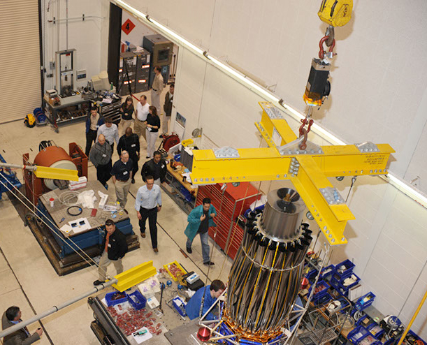

##Assembly and Integration##

The Assembly and Integration Section produces, inspects, assembles, and integrates hardware designed by the Spacecraft Engineering Division into spaceflight payloads and spacecraft. The section maintains highbay space to support assembly and integration activities, and manages a modern machine shop.