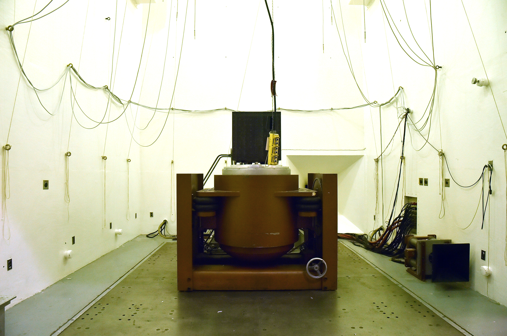

The acoustic reverberation chamber provides the capability to simulate the vibration and high-intensity acoustic-noise environment experienced by spacecraft structures and components during the launch phase of flight.

The acoustic reverberation chamber consists of a 10,000-ft3 reverberant chamber constructed of highly reinforced concrete 12-in thick designed to withstand an internal sound pressure level 170 dB painted with epoxy paint to enhance acoustic reflection. The chamber is 17 ft. wide, 21.5 ft. long, and 27 ft. high; it is accessed by a 3.5 x 7 ft. pedestrian door and a 12 x 12 ft. specimen door.

The low-frequency portion of the high-intensity noise spectrum within the room is generated by four external 10,000-acoustic-W, electro pneumatic transducers mounted at the apex of a 40 Hz steel, aluminum, and fiberglass horn. The transducers generate noise by modulating a 2000 ft2 /min (CFM) stream of gaseous nitrogen. The noise is introduced into the room through the mouth of the horn, which is an integral part of the chamber wall opposite the specimen door. High frequency noise is generated inside the room by two transducers, each mounted to a 150 Hz fiberglass horn and each rated at 10,000 acoustic W by modulating 1500 CFM of gaseous nitrogen. An overall sound pressure-level of 153 dB, with a frequency range of 32 to 10,000 Hz, is attainable in the chamber.