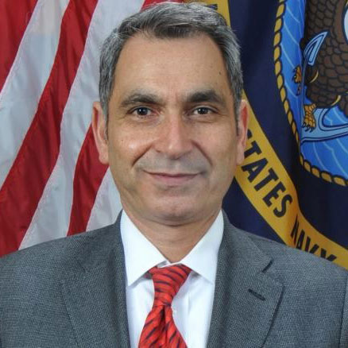

- Overview
- [Highlights](/our-work/areas-of-research/spacecraft-engineering/highlights)

The Spacecraft Engineering Division (SED) designs, builds, and operates pioneering and innovative spacecraft and space systems. The SED functions as a prototype laboratory for new and operationally relevant space based capabilities. From cradle to grave, the division provides expertise in mission design, systems design and engineering, and hardware expertise for every aspect of a space system. The division has a history of transitioning advanced technologies into operations and industry, applying expertise in systems integration, design and verification, dynamics and control systems, electronics and software, and mission operations to develop advanced space technologies.

##Leadership##

###GURPARTAP “GP” SANDHOO, D.SC.###

Superintendent: Spacecraft Engineering Department

E [spaenginfo@nrl.navy.mil](mailto:spaenginfo@nrl.navy.mil) P (202) 767 6408 F (202) 767 6429

Dr. Sandhoo is the Superintendent of the Spacecraft Engineering Division of the Naval Center of Space Technology (NCST) at the U.S. Naval Research Laboratory (NRL). As the superintendent, he provides executive direction and technical leadership in the development of policies and objectives necessary in conducting research, design and development in the areas of satellite and orbital transfer vehicle systems, with an emphasis on new and advanced space systems and technologies to improve the performance of the Navy mission.

The spacecraft engineering division is responsible for executing a $170 million program, including development of cutting-edge space capabilities in satellite servicing, space robotics, and satellite operations.

After working at NASA’s Johnson Space Center, Johns Hopkins University’s Applied Physics Laboratory, and in industry, Sandhoo began his career at NRL in 2005 as a senior aerospace engineer on the Operationally Responsive Space initiative. He progressed into broader roles at NRL, including time as the science advisor for the U.S. Navy’s Fifth Fleet in Bahrain, and as a member of Naval Warfare Integration group (N00X) on the staff of Chief of Naval Operations.

He holds a bachelor’s degree in mechanical engineering from the University of Maryland, a master’s degree in electrical engineering from Johns Hopkins University, a master’s from the U.S. Naval War College, a master’s and doctorate in aeronautics and astronautics from George Washington University, and is a MIT Seminar XXI fellow. Since 1986, he has served in uniform in the U.S. Marine Corps and U.S. Navy. Currently, Sandhoo is a Captain in the U.S. Navy Reserve as an Engineering Duty Officer.

He is recipient of numerous personal, unit, and campaign awards, which are all a tribute to the Sailors, Marines, and civilians he served alongside throughout his Navy, Marine and civilian career. Of them all, he most treasures his peer awarded Battalion Marine of the Year Award.