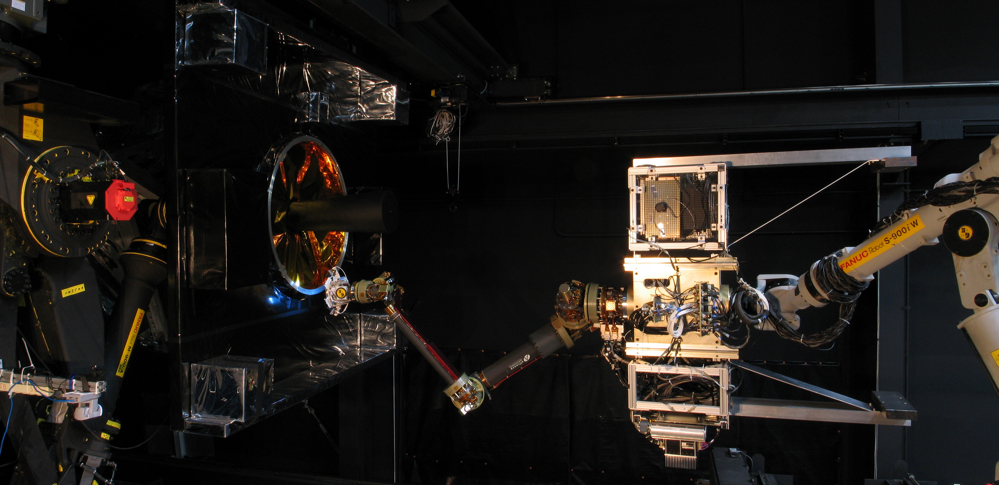

The Dynamics and Control Systems branch develops spacecraft attitude control, reaction control, robotics, and propulsion systems for NRL. This branch develops new space object tracking algorithms and codes, and develops terrestrial and marine variants of our space technologies for the Department of Defense. This branch performs research and development in these areas to explore new concepts, demonstrate applications, and field/transition prototype and operations systems. Personnel have practical and theoretical expertise in control sensors and actuators, spacecraft attitude determination and control techniques, fast steering and precision pointing, advanced propulsion systems, machine learning, machine vision, space system and autonomous system motion planning, spacecraft flight operations, computer modeling and simulation, and orbit dynamics. 