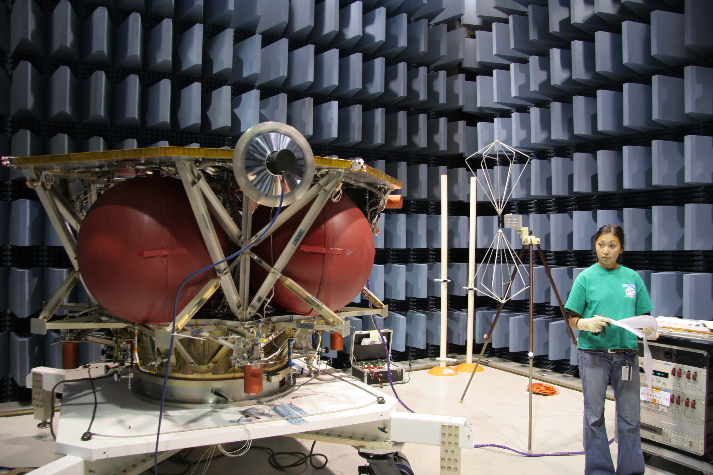

The Electronics and Software branch is responsible for development from concept to the final system product. In this role, the branch performs mission development and provides expertise needed to economically develop, implement, and test the concept. The branch provides detailed electrical and software design, development, fabrication, test, integration, launch, and on-orbit support of payloads, satellites, and space hardware. This includes radio frequency systems, digital electronics and processors, power and analog systems, flight software, test system electronics, and test systems software. The branch participates in advanced systems research and application development, as required, to perform its mission. 