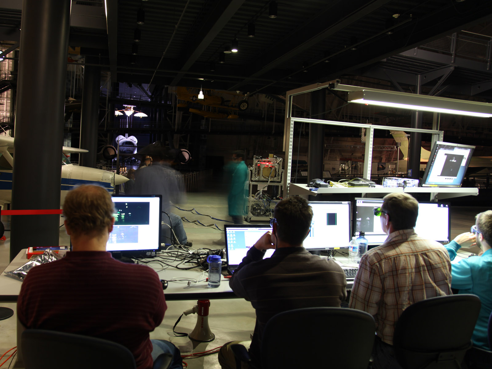

The Mathematics and Orbit Dynamics Section uses modern mathematical and computational techniques to perform basic and applied research in satellite orbit dynamics. The section researches and develops advanced methodologies in space situational awareness for transition to operational entities. This section develops efficient computer-based techniques for analysis of dynamic systems and performs satellite mission planning analysis. This section maintains the space situational awareness laboratory.