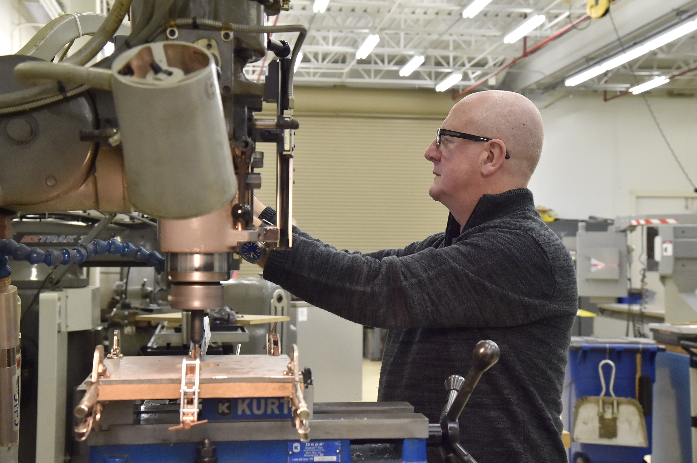

The Mechanical Design Section leads the design and development of space flight mechanical and structural hardware. The section conceptualizes, refines, and details the designs for electronic enclosures, payloads, primary and secondary structures, ground support equipment, assembly tools, and test fixtures. The section maintains two additive manufacturing machines for prototyping designs and supporting research and development activities.