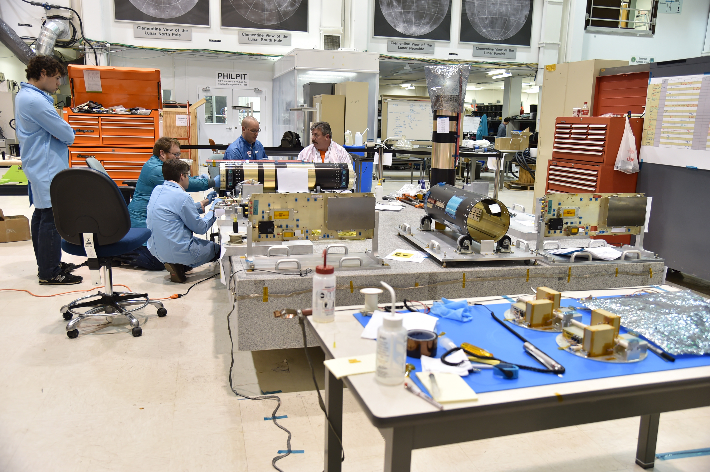

The Mechanisms Section leads the design, development, assembly, test, and on-orbit operation of state-of-the-art spacecraft mechanisms, including release devices, deployables, motors, slip rings, bearings, momentum devices, and robotics for the Spacecraft Engineering Division. The section is responsible for mechanisms development from initial concept to the final integrated system. The section collaborates with other SED sections to advance research and development projects and division objectives.