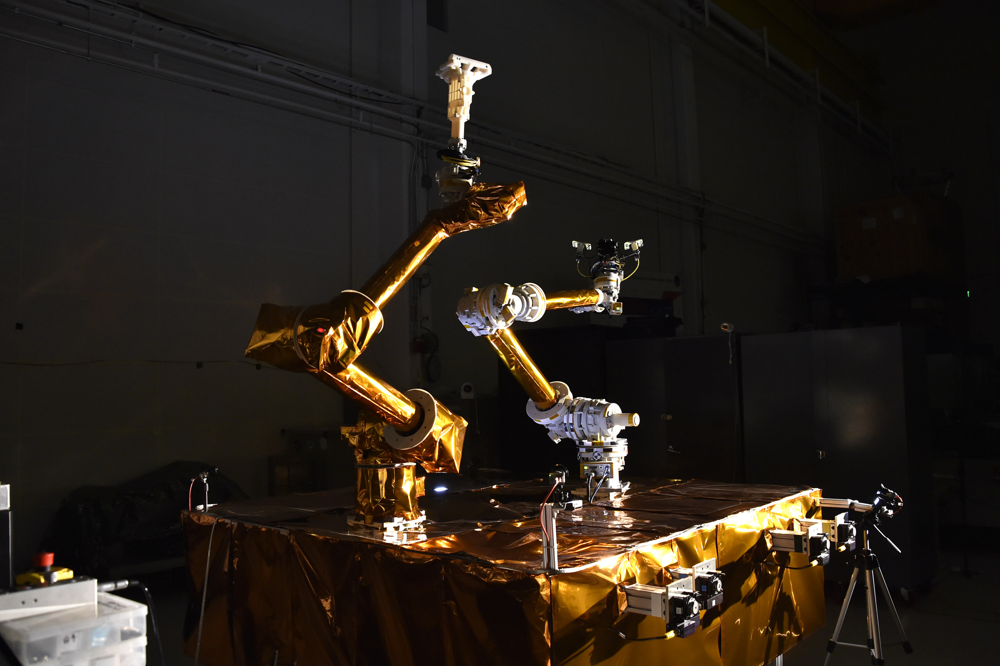

The Propulsion and Fluidic Systems Section performs all aspects of propulsion system development from concept design and analysis through propulsion system integration and test, and culminating in launch and flight operations. This section performs basic and applied research in spacecraft propulsion technologies including improved thruster and cathode systems, and other hydraulic and pneumatic technologies supporting multiple platforms and applications including unmanned robotic systems. This section performs experimentation and analysis of flows including liquid, gas, reactive, hypersonic, rarefied, pressurized, adiabatic/non-adiabatic, pumped, or charged. This section maintains specialized cleanrooms, propulsion system integration and test equipment, and research facilities including the Electric Propulsion Plasma Chamber.