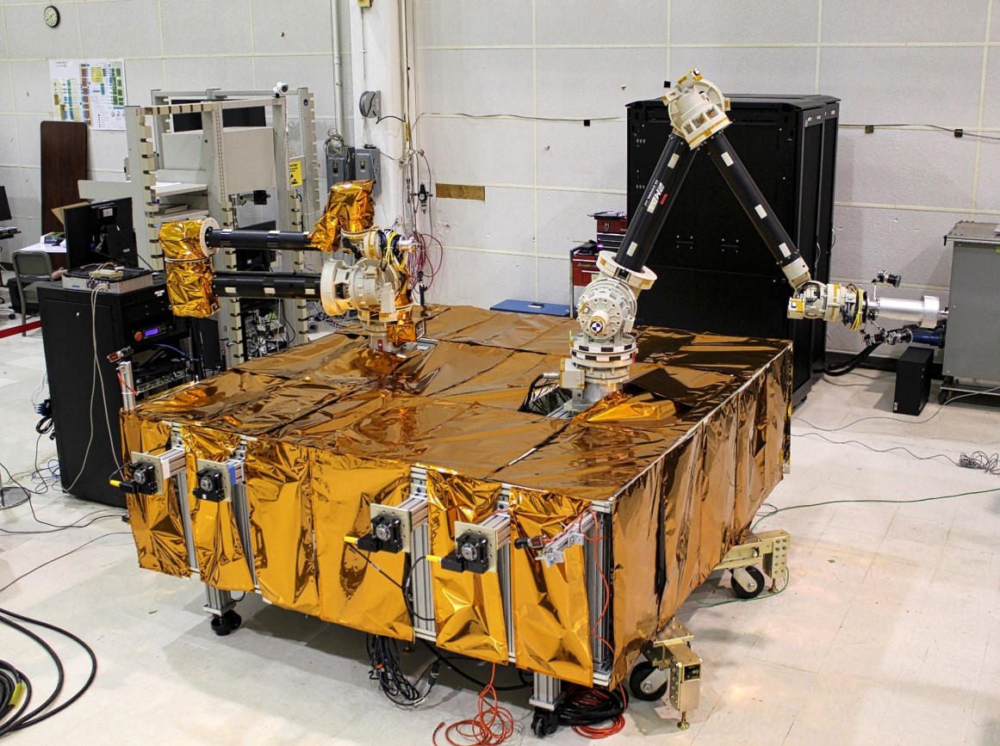

The Robotics and Machine Learning Section develops advanced space robotics concepts, including spacecraft servicing and orbital construction technologies; focusing on dexterous robotic manipulation including nonlinear and adaptive controls, perceptual modalities, and robotic autonomy. This section also develops related robotic manipulation and locomotion technologies to support terrestrial and undersea robotic missions. This section performs research into more general robotics and autonomous system’s capabilities to enable militarily relevant capabilities.  This section leverages existing NCST expertise in mechanical and electrical engineering and broader NRL expertise in interface design, artificial intelligence, chemistry, sensing and materials engineering to support these research and development efforts. This section maintains the Merlin laboratory, the space robotics laboratory test beds including the gravity offset table, and the machine vision laboratory.