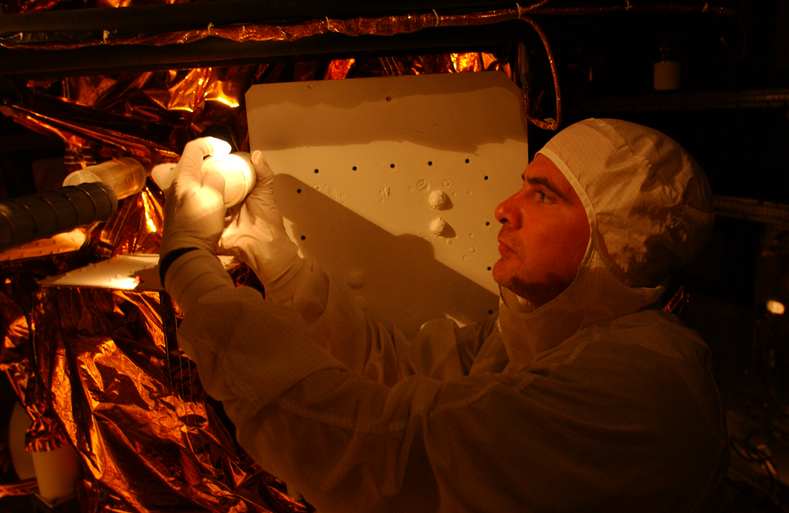

The Spacecraft Command and Control section provides enterprise satellite command and control (C2) solutions to the Navy and the broader Department of Defense, that reimagines satellite operations which meet current and future mission C2 and testing requirements. This section primarily develops and maintains the Neptune™ software, ensuring that the software is reliable, cyber-secured and able to meet current and future C2 and testing requirements of both the division and external users. Spacecraft Command and Control collaborates with other elements of the branch to deliver innovative solutions that meet emerging challenges in the space domain.