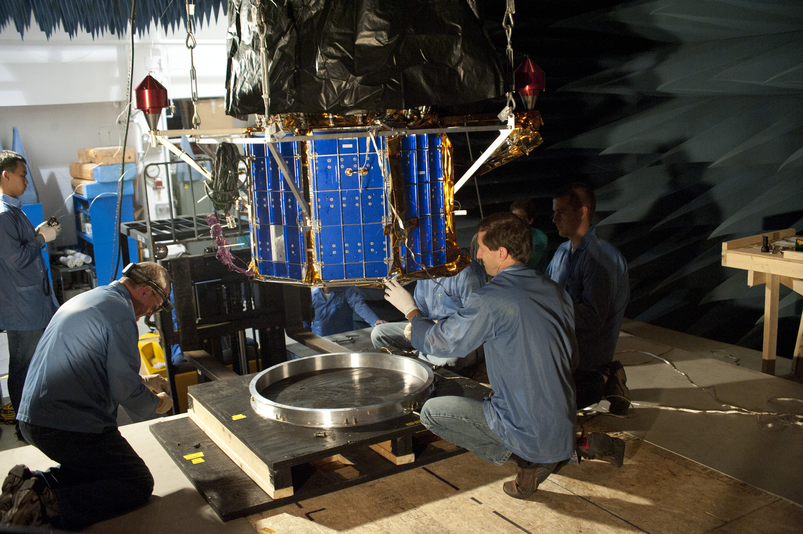

The Systems Integration Branch is responsible for mechanical systems development, from conceptual layout and design, to spacecraft integration on a launch vehicle. The branch provides concept development for new missions; detailed mechanical, structural, and mechanisms designs; fabrication, assembly, and integration of space flight hardware; and launch and on-orbit support of spacecraft mechanisms.