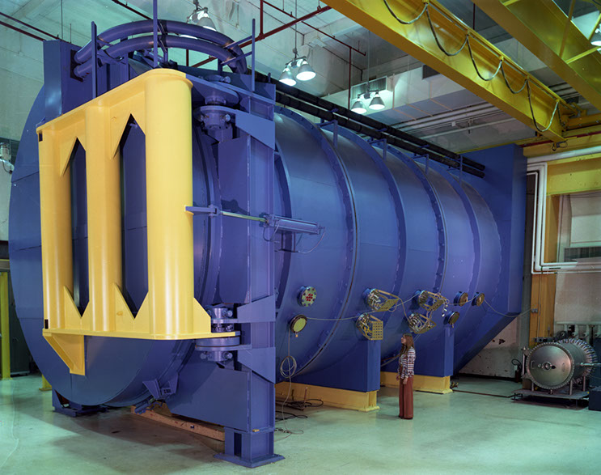

The Systems Test Section develops, operates, and maintains the SED’s major environmental testing facilities. In concert with the Thermal and Structural Engineering sections, the Systems Test section aids in the planning, setup, and execution of environmental and design verification tests, ensuring the appropriate facilities are prepared and configured to safely and effectively perform qualification and acceptance testing. To meet program needs, the section operates and maintains the vibration test lab, acoustic chamber, modal survey test system, loads test equipment, thermal and thermal vacuum test facilities, spin balance, and mass properties testing facilities.