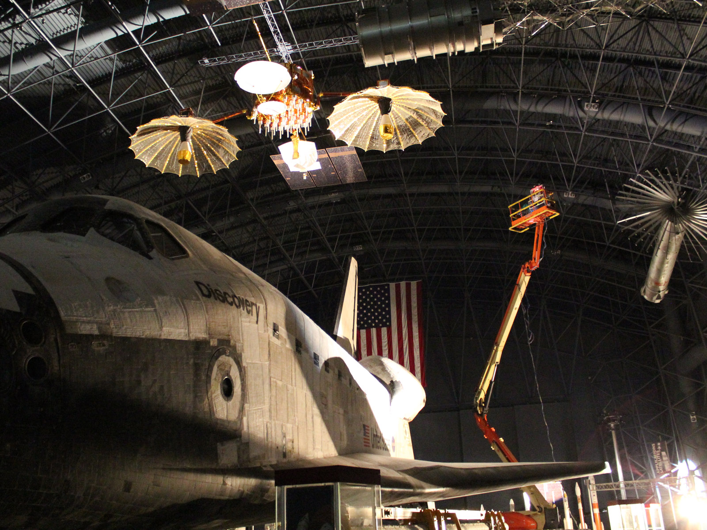

 The Test Systems Software (TSSW) Section develops spacecraft test systems software in support of the integration, verification and qualification of all spacecraft systems from initial concept through on-orbit operations. The section develops test equipment interfaces, integrates commercial and government software tools, and employs automated testing techniques to ensure proper operation under space and launch conditions. TSSW also develops spacecraft hardware emulators and simulated interfaces for the verification of real-time operational scenarios supporting spacecraft ‘day in the life’ exercises. The section provides verification support for all mission phases, including breadboard, engineering model and flight model electronics development, spacecraft integration and test, launch site operations, and mission operations.