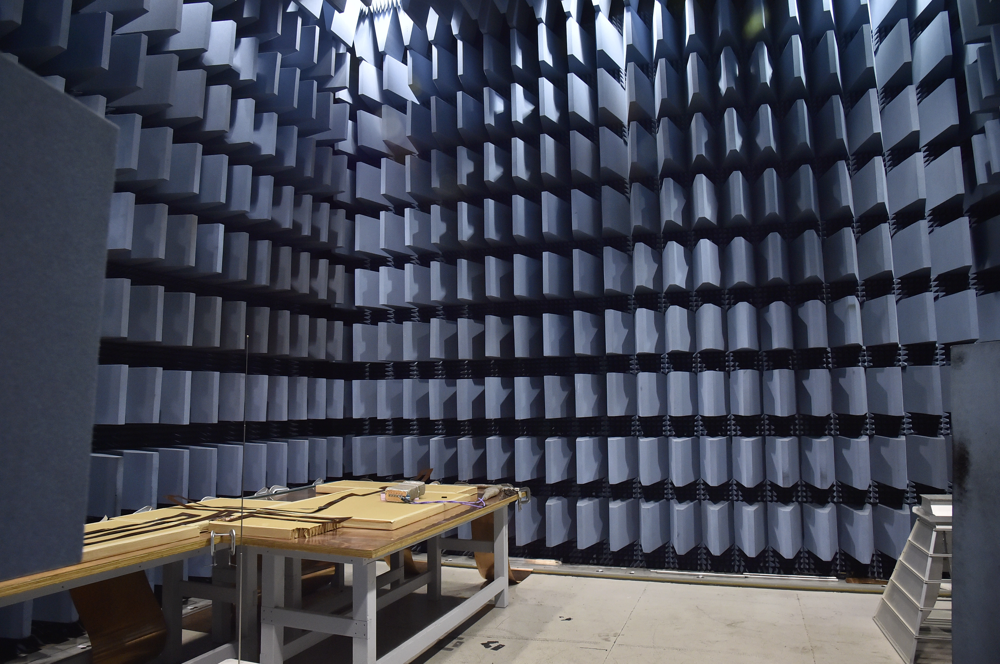

The Electromagnetic Interference / Electromagnetic Compatibility (EMI/EMC) Test Facility provides the capability to test and evaluate spacecraft electronic subsystems for electromagnetic compatibility with companion subsystems and/or various spacecraft launch vehicles to ensure all electronic systems will operate in harmony with one another in a space environment.

The EMI/EMC is constructed of an all steel frame 15 x 18 ft. with welded sheet steel walls. It is equipped with a rolling air bladder door to provide 100 dB of radio frequency attenuation from 10 KHz to 20 GHz. A radio frequency panel of Triax and SMA connectors provides access to the chamber from the external test bed. This test bed consists of four racks of test equipment used to provide MIL-STD-461/462 EMC testing. Air-conditioning, lighting, and AC power receptacles are provided through radio frequency filtered ducts. The chamber is grounded by a copper bus attached directly to the steel frame and connected to an external ground plane.