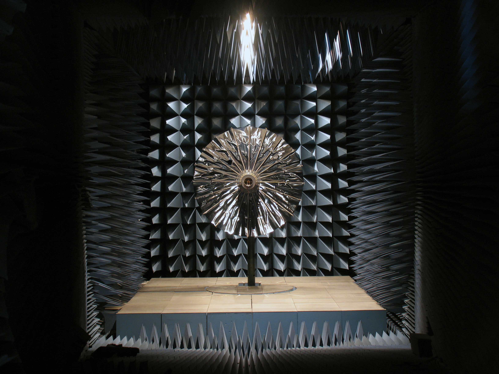

The radio frequency anechoic chamber supports the design, manufacture, and test of antenna systems. The facility is also used as an electromagnetic compatibility and radio frequency interference test chamber. 

The facility consists of a secondary 21-ft anechoic chamber and machine shop. The main facility is a shielded 120-ft tapered anechoic chamber with an automatic test measurement system. This chamber is 31 x 31 x 120 ft. in length and pyramidal in shape. In the center of the test area floor is a pit, 9 ft. in diameter, which extends 4 ft. below the shielded floor of the chamber. The pit contains the large model tower positioner base and two scissor lifts, each capable of lifting one ton. The scissor lifts can be used to move the circular floor section about 8 ft. above the floor level.

The entire anechoic chamber is within a double-sided and double-shielded room. Shielded space is also available all around the conical end on the second floor. All doors and door openings have solid brass sides with double layers of compressible brass.